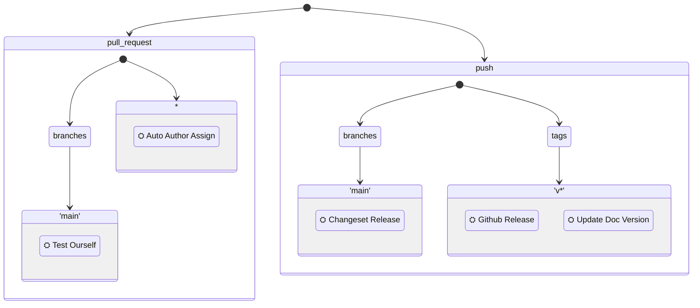
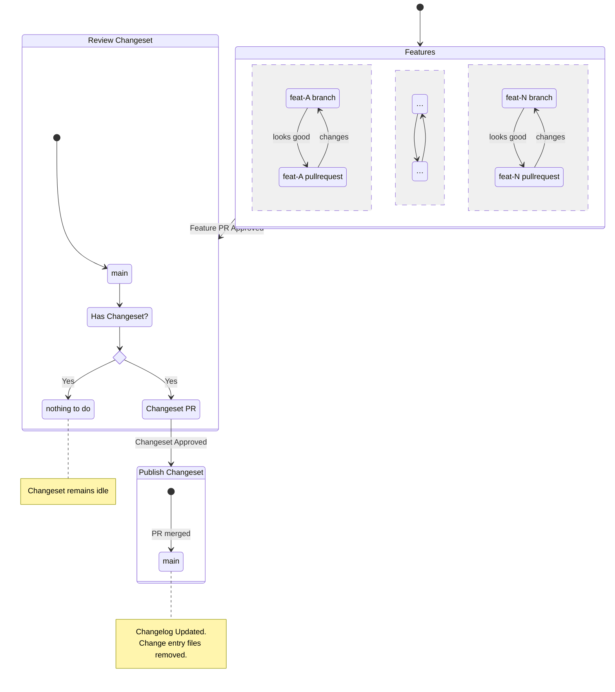

# A Suggested Workflow

## Workflow Triggers

```mermaid
stateDiagram-v2

auto_author_assign: ⛭ Auto Author Assign
changeset_release: ⛭ Changeset Release
github_release: ⛭ Github Release
pull_request_branches: branches
pull_request_any: *
pull_request_main: 'main'
push_branches: branches
push_branches_main: 'main'
push_tags: tags
push_tags_v: 'v*'
update_doc_version: ⛭ Update Doc Version
use_self: ⛭ Test Ourself

[*] --> pull_request
[*] --> push

state pull_request {
  [*] --> pull_request_any
  [*] --> pull_request_branches
  pull_request_branches --> pull_request_main

  state pull_request_any {
    auto_author_assign
  }

  pull_request_branches
  state pull_request_main {
    use_self
  }
}

state push {
  [*] --> push_branches
  [*] --> push_tags
  push_branches --> push_branches_main
  push_tags --> push_tags_v

  push_branches
  state push_branches_main {
    changeset_release
  }

  push_tags
  state push_tags_v {
    github_release
    update_doc_version
  }
}

```

## An Overview Of Changeset

```mermaid
stateDiagram-v2
  direction TB

  [*] --> Features

  branchA: feat-A branch
  prA: feat-A pullrequest
  branchDot: …
  prDot: …
  branchN: feat-N branch
  prN: feat-N pullrequest

  state Features {
    branchA --> prA: looks good
    prA --> branchA: changes
    --
    branchDot --> prDot
    prDot --> branchDot
    --
    branchN --> prN: looks good
    prN --> branchN: changes
  }

  Features --> ChangesetPR: Feature PR Approved

  ChangesetPR: Review Changeset
  state ChangesetPR {
    branchMain: main
    prChange: Changeset PR
    hasChangeset: Has Changeset?
    nothing: nothing to do

    [*] --> branchMain
    branchMain --> hasChangeset

    state if_state <<choice>>
    hasChangeset --> if_state
    if_state --> prChange : Yes
    if_state --> nothing : Yes
    note right of nothing
      Changeset remains idle
    end note
  }

  prChange --> ChangesetPublish: Changeset Approved

  ChangesetPublish: Publish Changeset
  state ChangesetPublish {
    [*] --> branchMainPublish: PR merged
    branchMainPublish: main
    note right of branchMainPublish
      Changelog Updated.
      Change entry files removed.
    end note
  }


```
