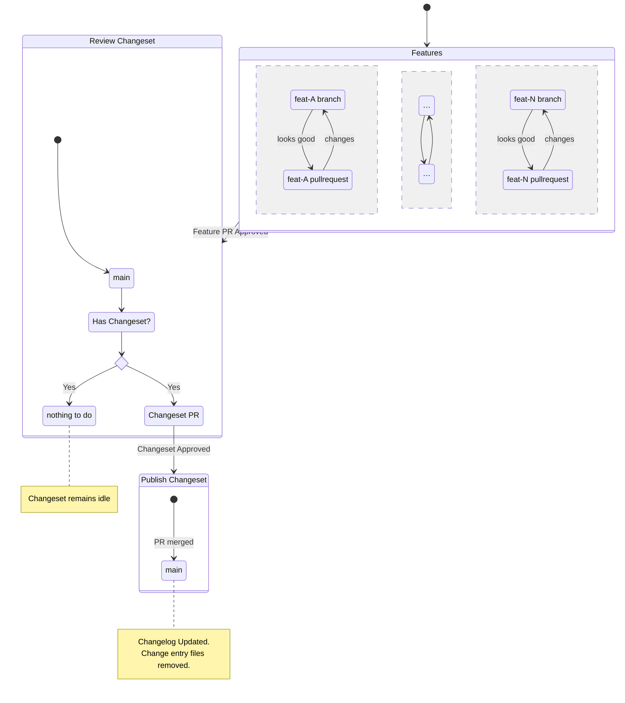

# Changeset Flow Overview

You can read about the full details of Changesets in the
[official project documentation](https://github.com/changesets/changesets#readme)

## Anticipated Workflow

In a nutshell:

- work on a feature, in a branch
  - follow the usual process to develop
  - create at least _one_
    [changeset](https://github.com/changesets/changesets/blob/main/docs/intro-to-using-changesets.md)
    - `yarn changeset`
    - commit this with your feature branch
- follow the usual process for reviewing, approving and merging a PR
  - once merged you shoud **NOT** expect an automatic release, or changelog
    update
  - there should be a PR created by the
    [changeset bot](https://github.com/apps/changeset-bot)
  - merging this will trigger the action path that combines the parts of the
    changeset into an updated entry in the CHANGELOG

The default changesets behaviour **DOES NOT**:

- push new tags to the repo
- create a Github Release
- update documentation to reflect changes in version numbers

For suggestions on managing these steps please read
[Full Workflow Suggetion](full-workflow-suggestion.md).

### A Visualisation of the Flow

