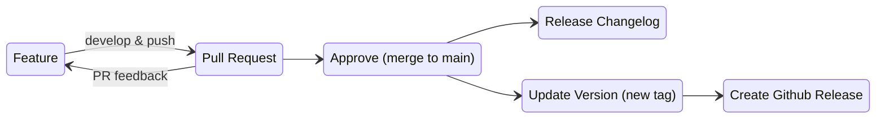
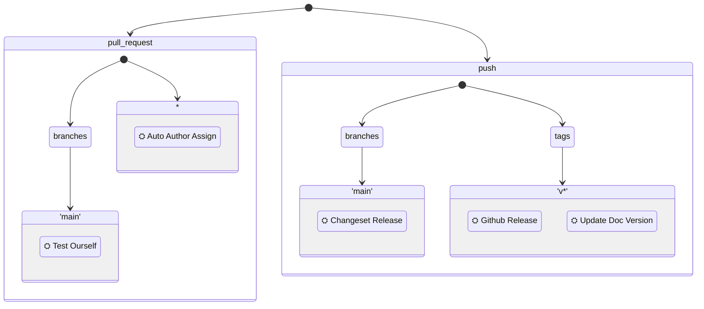

# Full Workflow Suggestion

Working with
[Changesets](https://github.com/changesets/changesets#readme)
required a shift in how I percieved a workflow that included:

- normal development flow
  - feature branches
  - pull requests
- changelog management
- automatic versioning (i.e. tags)
- automatic releases

Historically workflows I've used have followed the flow:

As described in
[Changeset Flow Overview](changeset-flow-overview.md)
this is no longer true when using
[Changesets](https://github.com/changesets/changesets#readme).

A PR merged to `main` now indicates that something is "Ready to Release".
`main` should still be stable, and something you would be happy to release.

With
[Changesets](https://github.com/changesets/changesets#readme)
you control your production releases through the special pull request created
by the
[changeset bot](https://github.com/apps/changeset-bot).

The suggested change to any automated workflows is that:

> production deployments only occur when a new version is tagged

## Steps to Automate

### Auto Author Assign

Having PRs automatically assigned (to the PR creator) is quite useful and easy
to add to you project workflow.

See
[assign-pr.yml](../.github/workflows/assign-pr.yml)
for an example of this in action.

### Changeset Management

If you're here you're almost certainly already thinking about this, and also
probably thinking about
[Changesets](https://github.com/changesets/changesets#readme).

This repo's
[README](../README.md)
should explain how you can use this in your project workflow.

### Automatic Versioning

There's no 'one-solution-fits-all' proposal here.

This project currently recommends
[adding a Push Tags](../README.md#as-part-of-a-release-workflow)
step to the Changeset workflow.

### Update Versions Referenced in README (and other docs)

Searches to date haven't revealed any strong contenders for "find relevant
version references and update them" actions or tools that can be quickly added
to a Github workflow.

In the spirit of "first, make it work; then make it better" this project currently:

- uses `sed` on a list of file(s)
- creates a new pull request with those changes
- sets the pull request to auto-approve
  - it also uses `[skip ci]` to avoid a failed run for the Changeset action

For now, it's Good Enough™ and keeps the versions mentioned in README up to
date.

You can see how this is implemented by looking at
[update-doc-version.yml](../.github/workflows/update-doc-version.yml)

## Benefits

One of the main benefits of this approach is you don't get into the situation
where you're trying to work out how to allow a bot or action to push to
protected branches.

This is a real issue I faced when trying to leverage
[`changie`](https://changie.dev/)
for changelog management.

## Workflow Triggers

